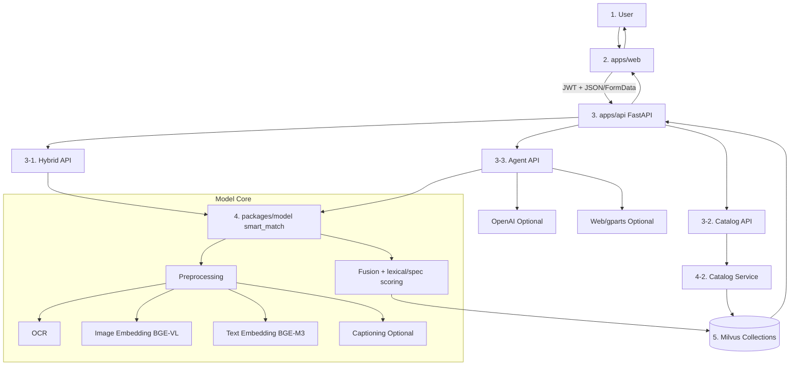
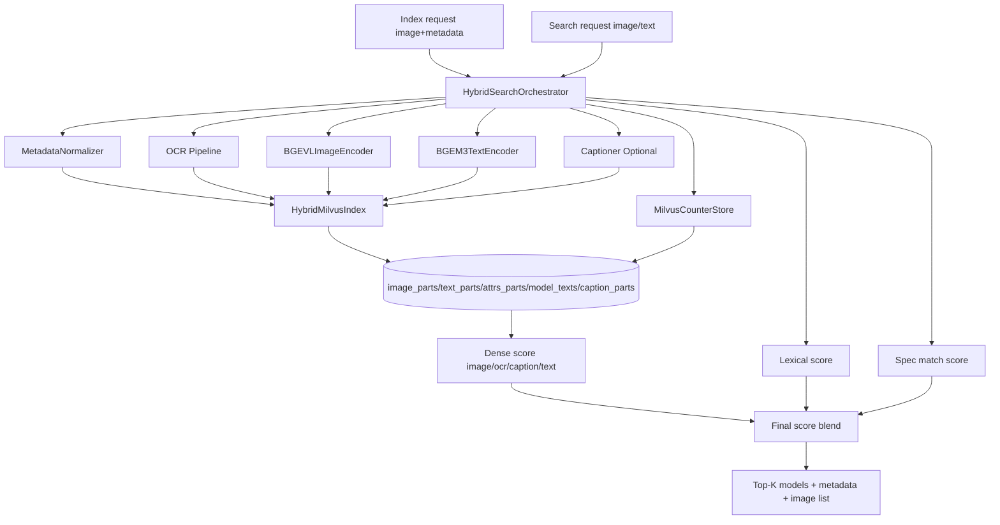
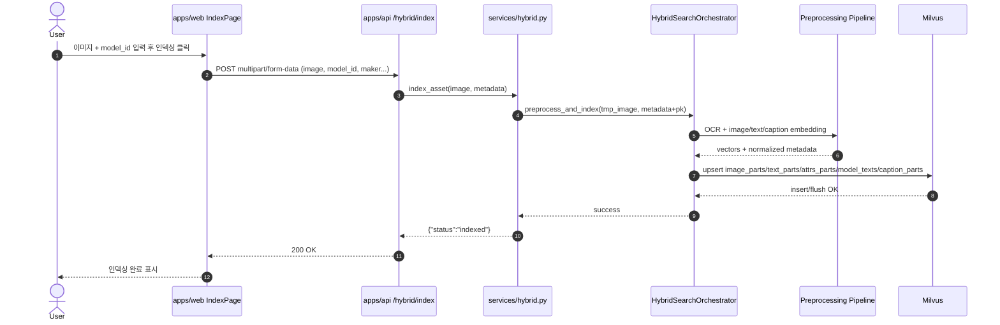

# Smart Vision Architecture (Mermaid)

아래 다이어그램은 `흐름`이 보이도록 입력 → 처리 → 저장/응답 순서로 다시 정리했습니다.

## 1) 전체 Pipeline (End-to-End)



## 2) Frontend 상세 (`apps/web`)

```mermaid
flowchart LR
  B[Browser] --> APP[src/App.tsx]
  APP --> AUTH[auth state]
  AUTH --> LAYOUT[AppShellLayout]

  LAYOUT --> IDX[IndexPage]
  LAYOUT --> SRCH[SearchPage]
  LAYOUT --> CHAT[AgentChatPage]
  LAYOUT --> CAT[CatalogPage]

  IDX --> U[src/utils/api.ts]
  SRCH --> U
  CHAT --> U
  CAT --> U

  U --> H1[/api/v1/hybrid/index]
  U --> H2[/api/v1/hybrid/search]
  U --> H3[/api/v1/agent/chat]
  U --> H4[/api/v1/catalog/index_pdf]
  U --> H5[/api/v1/catalog/search]

  H1 --> V1[Index success/fail]
  H2 --> V2[Top-K results + scores]
  H3 --> V3[Answer + sources + identified]
  H5 --> V4[Catalog chunk list + source/page]
```

## 3) Model 상세 (`packages/model/smart_match`)



## 4) Sequence 상세 (`/api/v1/hybrid/index`)


