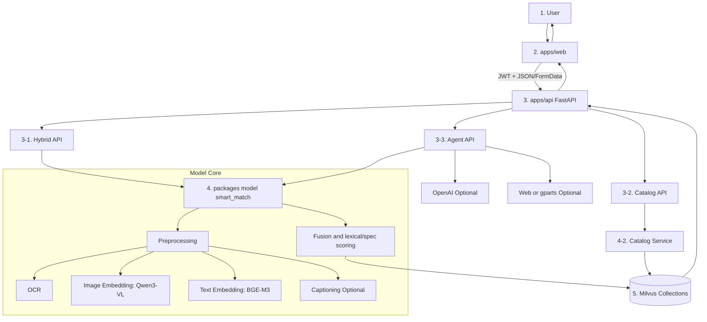
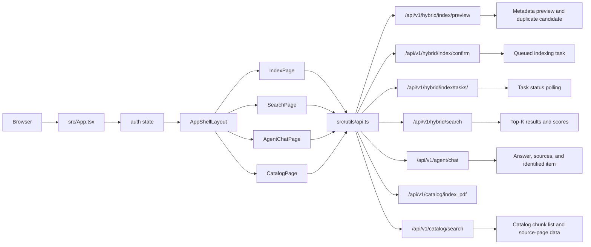
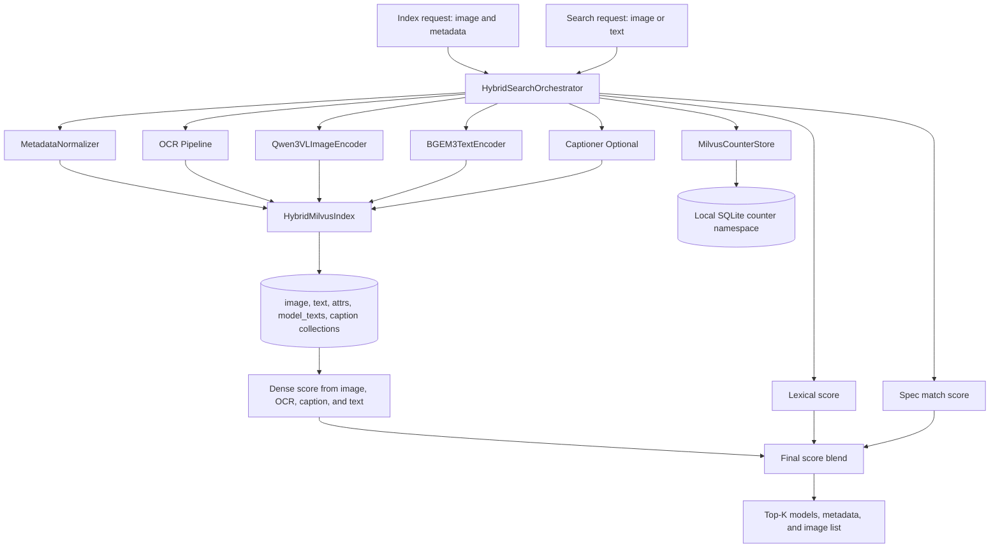
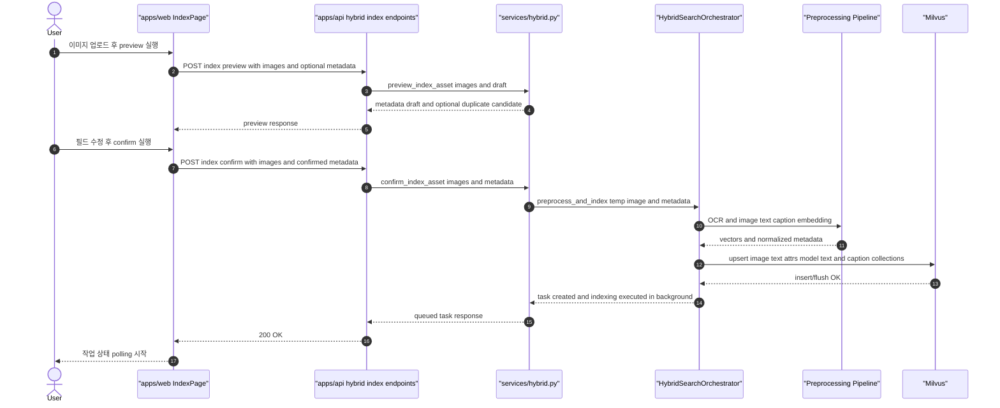
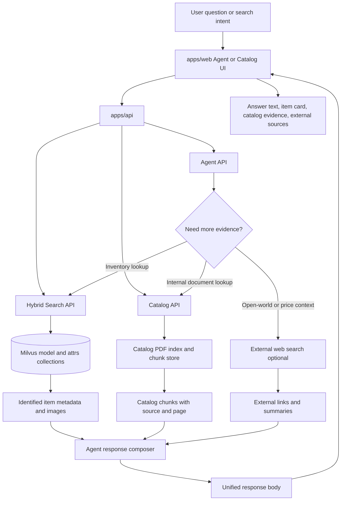

# Smart Vision Architecture (Mermaid)

아래 다이어그램은 `흐름`이 보이도록 입력 → 처리 → 저장/응답 순서로 다시 정리했습니다.

## 1) 전체 Pipeline (End-to-End)

## 2) Frontend 상세 (`apps/web`)

## 3) Model 상세 (`packages/model/smart_match`)

## 4) Sequence 상세 (`/api/v1/hybrid/index/preview` + `/api/v1/hybrid/index/confirm`)

## 5) Catalog + Agent Orchestration Path

