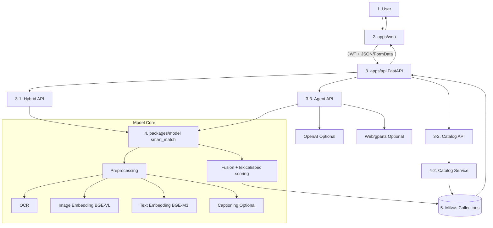
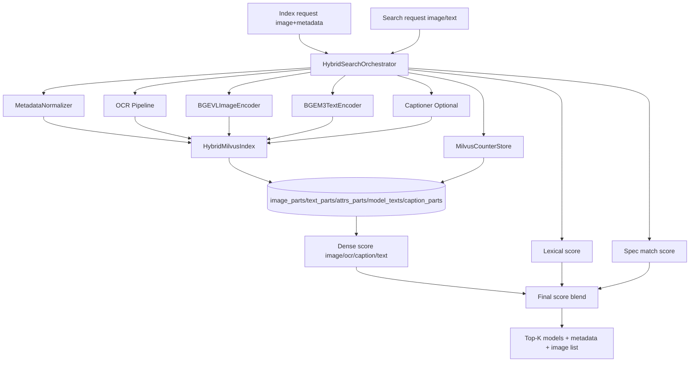
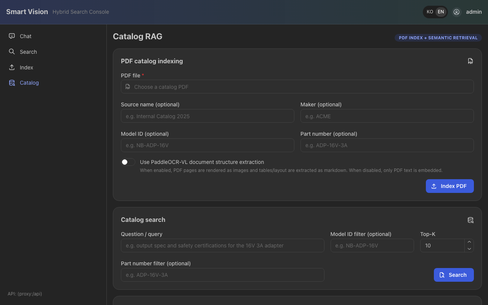
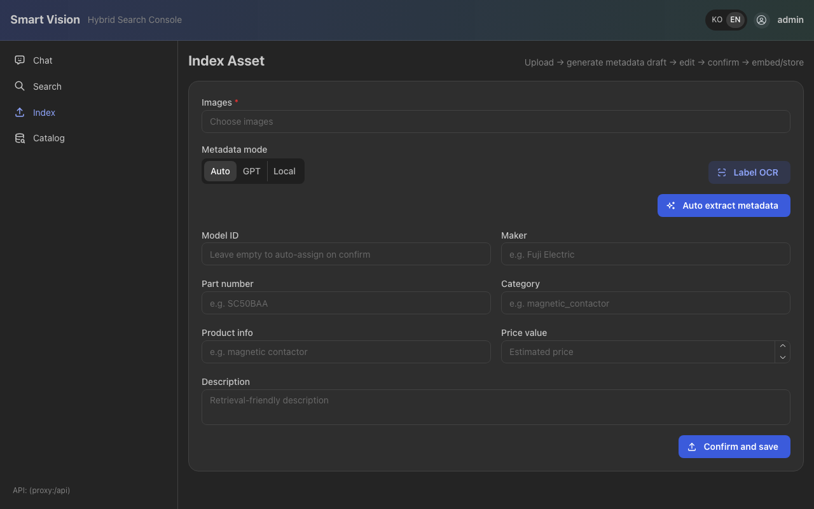
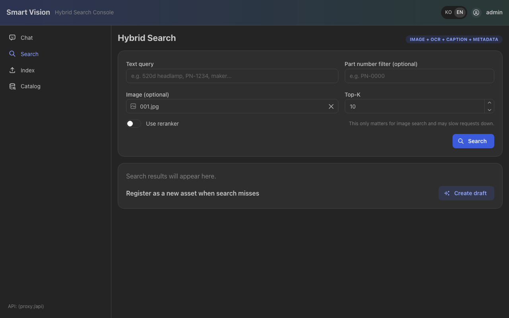
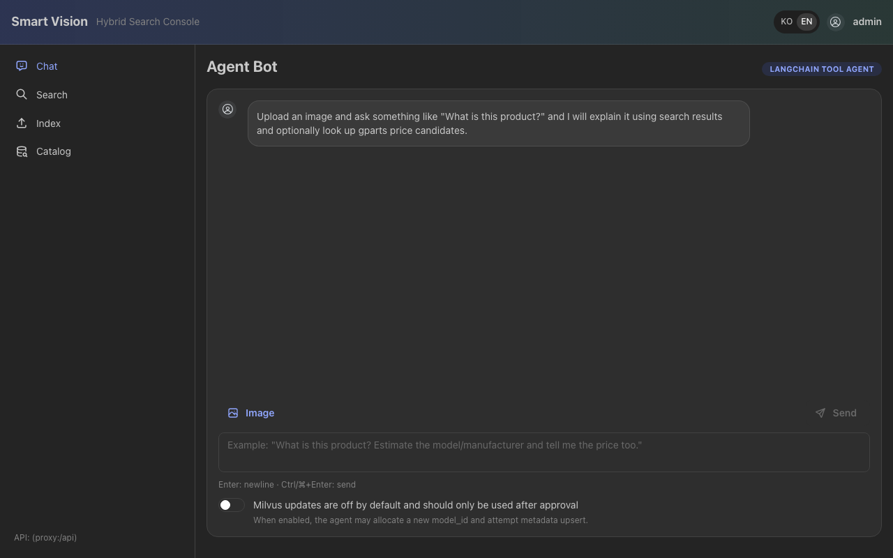

# Smart Image Part Identifier for Secondhand Platforms

University of London  
Bachelor in Computer Science

Final Project  
CM3020 Artificial Intelligence, "Orchestrating AI models to achieve a goal"

Name: SuHun Hong  
Email: hshlalla@naver.com

> Working note: this is a DOCX-ready manuscript draft for internal use. Remove this note before final submission.

## 1. Introduction

This project follows the CM3020 template "Orchestrating AI models to achieve a goal". It addresses the problem of identifying industrial and electronic parts from photos in secondhand listing workflows, where users often need help determining the correct maker, model, or part number before they can create a reliable listing.

The problem is important because secondhand platforms increasingly include items whose value and usability depend on precise identification. A misidentified consumer good may still be searchable by appearance alone, but a misidentified industrial part can lead to incorrect pricing, poor discoverability, and failed transactions. In many cases, the decisive signal is not the global appearance of the object but a small identifier such as a model code, serial number, or nameplate. Those signals are frequently hard to capture in user-generated images because of glare, blur, low resolution, wear, or partial occlusion. As a result, sellers without domain expertise often resort to slow manual comparison against catalogues, manuals, or search-engine results.

Industry trends indicate that photo-based assistance can reduce listing friction. eBay has shown that image-based retrieval can support marketplace-scale search [2], and Korean secondhand platforms have introduced AI-assisted listing tools that infer product information from uploaded photos [3]. However, these systems mainly target broad consumer products. Part identification is more difficult because many components are visually similar across variants, while the information that distinguishes them is often small, noisy, or text-based. A practical solution must therefore treat the problem as more than generic image similarity.

The central claim of this project is that secondhand part identification should be framed as a retrieval-first, human-in-the-loop decision-support problem rather than a closed-set classification problem. A useful system should combine visual and textual evidence when available, remain useful when OCR fails, return structured outputs aligned with listing workflows, and present results in a way that supports user verification rather than overconfident automation.

This framing is justified by both domain constraints and user requirements. From the domain perspective, secondhand part inventories are open-world and long-tailed: new, rare, and discontinued items appear continuously, making fixed closed-set classification a poor fit [10,21]. The domain is also highly fine-grained. In many cases, two parts differ only by a small marking or identifier rather than by overall shape [4,10]. In addition, marketplace images are noisy and uncontrolled, which means OCR can be useful but cannot be treated as ground truth. Finally, the output must be listing-oriented. A user does not merely need a visually similar image; they need fields such as maker, part number, category, and supporting evidence that can be used to complete a listing with confidence.

User evidence points in the same direction. A short requirements elicitation survey with six participants familiar with secondhand platforms suggested that writing detailed specifications is difficult, manual search remains common, and users are broadly open to photo-based assistance. At the same time, respondents did not express unconditional trust in AI outputs. Instead, transparency and the ability to verify or edit results were repeatedly emphasised. This supports a shortlist-based workflow in which the system narrows the candidate space and exposes evidence, while the user remains responsible for the final decision.

[Insert Table 1-1 here: Summary of survey findings and requirement implications.]

These observations motivate the project aim: to build and evaluate an end-to-end prototype that takes a user photo of a part and returns a Top-5 shortlist of candidate matches together with a concise listing-oriented summary and supporting evidence. The main objectives are to implement the end-to-end workflow, assess retrieval effectiveness, analyse OCR robustness, add latency instrumentation for interactive feasibility, and evaluate the extent to which the prototype can support practical listing assistance.

The remainder of this report is organised as follows. Chapter 2 reviews prior work in visual retrieval, OCR, multimodal embeddings, vector databases, and interactive feedback. Chapter 3 presents the design of the system and embeds the evaluation strategy into that design. Chapter 4 describes the implementation of the prototype across the web, API, and model layers. Chapter 5 evaluates the available evidence, separating completed benchmark results from instrumentation and planned quantitative work. Chapter 6 concludes with a summary of contributions, limitations, and future work.

## 2. Literature Review

Visual retrieval has a long history in computer vision, moving from handcrafted descriptors toward deep feature embeddings that support large-scale semantic search [22]. Consumer systems such as eBay image search demonstrate that image-based retrieval can reduce friction when users do not know the right keywords [2, 23]. Google Lens and similar tools generalise this pattern by allowing users to search from photos across many object types [8]. These systems are relevant because they show that image-based queries can be practical at scale. However, their main successes concern whole consumer products rather than fine-grained parts with subtle inter-class variation.

Industrial and part-specific literature is therefore more directly relevant. Li and Chen show that industrial machine parts can be recognised using transfer learning on a curated dataset [10], but that approach assumes a closed set of categories and enough labelled examples per class. This is a poor match for secondhand marketplaces, where long-tail inventory changes continuously. Retrieval-based industrial work is closer to the current problem because it allows the system to search among indexed items without retraining. Yet even retrieval-oriented studies often assume more homogeneous datasets than real marketplace imagery provides [11]. The literature therefore supports the use of deep visual embeddings, but it also suggests that vision-only approaches face clear limits in open-world, fine-grained settings.

One response to these limits is region focus through object detection. Systems such as VOVA's search-by-image workflow use a detector to isolate the relevant object before extracting embeddings, improving retrieval quality by reducing background noise [5]. For secondhand parts, this is an appealing idea because user photos may include cluttered workbenches, packaging, or irrelevant backgrounds, and OCR may also benefit from targeted crops around labels or nameplates. However, off-the-shelf detectors generally do not include the domain-specific part categories needed here. This creates a practical trade-off: detection may improve quality, but it introduces annotation and model-maintenance costs. The present project therefore treats detection and focused cropping as a strong future extension rather than a requirement for the MVP.

OCR is a more immediate source of complementary evidence. Industrial case studies show that text such as part numbers, labels, or serial numbers can be decisive when visual similarity alone is insufficient [12]. This is especially true for small replacement parts, where two items may appear identical until their printed identifiers are inspected. However, OCR is inherently noisy. Low resolution, blur, glare, curved surfaces, mixed orientations, and engraved text can all lead to character-level errors. In this domain, a single wrong character may imply the wrong part entirely. The literature therefore motivates a crucial design principle for this project: OCR should be treated as probabilistic evidence that strengthens retrieval when useful, not as a hard constraint that overrides all other signals.

Multimodal embeddings provide the representational foundation for such a design. CLIP-style models support comparisons between images and text within related embedding spaces [13,21], and newer open models such as BGE-VL make this approach practical in engineering settings. On the text side, BGE-M3 is particularly relevant because it supports multilingual retrieval and multiple retrieval modes in one framework [6]. This matters because secondhand listings often contain mixed-language descriptions, brand names, abbreviations, and OCR snippets. However, these models are trained on broad internet data rather than on low-quality close-up photographs of industrial parts. That means they are useful baselines but not complete solutions. Strong performance depends not only on the underlying embedding model, but also on system-level orchestration, lexical matching, metadata handling, and post-retrieval reasoning.

Vector databases are the infrastructure that make such orchestration practical. Milvus supports scalable similarity search across multiple vector types and can store several representations of the same item, such as image vectors, OCR-derived text vectors, caption text, and model-level metadata [15,16]. This is important because the retrieval problem here is not simply nearest-neighbour search in one embedding space. It is a problem of combining multiple incomplete and potentially contradictory signals. The literature provides strong patterns for multi-vector retrieval, but it leaves open important engineering questions about weighting, fallback behaviour, and uncertainty management. Those questions sit at the centre of the present project.

Interactive feedback and relevance feedback literature provide the final conceptual ingredient. Recent work revisits classical CBIR feedback ideas in the context of modern embedding models, showing that user interaction can improve retrieval without requiring the encoder itself to be retrained [18]. For secondhand marketplaces, the practical analogue is that confirmation or correction can be logged and later reused to improve ranking or metadata quality. This does not mean that the MVP must implement a full online-learning loop. It does mean that the system should be designed so that human decisions are preserved and can later support safer writeback, auditability, and future adaptation.

Taken together, the literature suggests that no single technique is sufficient. Vision-only retrieval is promising but limited for fine-grained parts. OCR is useful but unreliable under uncontrolled conditions. Multimodal embeddings and vector databases enable flexible hybrid search, but they still need task-specific orchestration. Feedback is practically important, especially in open-world settings where uncertainty remains high. These observations define the gap addressed by this project: an end-to-end system that combines visual search, OCR, catalog evidence, and tool orchestration in a way that is aligned with the realities of secondhand listing workflows rather than laboratory-style classification tasks.

## 3. Design

The design follows directly from the requirements and literature. The system is intentionally retrieval-first, multimodal, and evidence-oriented. Its purpose is not to produce one unqualified label, but to help a user narrow the candidate space and inspect enough supporting information to make a reliable decision.

### 3.1 Domain and User Requirements

The system's design is heavily informed by specific domain constraints and user needs within secondhand platform workflows. From the domain perspective, secondhand part inventories are open-world and long-tailed: new, rare, and discontinued items appear continuously, making fixed closed-set classification a poor fit [10, 21]. The domain is also highly fine-grained; parts often differ only by small identifiers rather than overall shape [4, 10, 24]. Marketplace images are notoriously noisy and uncontrolled, necessitating a system that treats OCR as probabilistic rather than absolute ground truth [25].

Furthermore, user requirements gathered through an elicitation survey of six secondhand platform participants indicated a strong preference for photo-based assistance over manually querying part numbers. However, users expressed a need for transparency and verifiability rather than blind trust in automated AI systems [26]. These insights, supported by prior literature on trust in human-AI interaction [27], strictly require a shortlist-based architecture where users retain the final decision-making power.

[Insert Table 1-1 here: Summary of survey findings and requirement implications.]

### 3.2 System Architecture

The design is guided by five core goals. First, the system must support open-world identification, so retrieval is favoured over closed-set classification. Second, it must handle fine-grained ambiguity by combining multiple modalities rather than trusting visual similarity alone. Third, it must degrade gracefully when some evidence is missing or noisy. Fourth, it must produce outputs that are directly usable in listing workflows. Fifth, it must be instrumented so that evaluation is traceable and tied to the system's intended use.

*Figure 3-1: Overall system architecture.*

At the highest level, the architecture is divided into a user-facing interaction layer, an orchestration layer, a perception and representation layer, and a retrieval and knowledge layer. The primary user-facing path is a React web application backed by a FastAPI service. This corrects an ambiguity in earlier drafts: Gradio is retained as a developer-facing demo and debugging interface, but it is not the main final user interface. Behind the UI, a hybrid-search orchestrator coordinates OCR, embedding generation, vector search, score fusion, and result normalisation. The perception layer includes OCR, image embeddings, text embeddings, and optional caption generation. The retrieval layer includes Milvus collections for several modalities as well as a separate index for internal catalog documents.

The data model deliberately separates model-level information from image-level and text-level evidence. At the conceptual level, the system deals with models or parts, image assets, OCR-derived text, and embeddings. At the storage level, these are mapped to separate Milvus collections rather than collapsed into a single structure. This allows the same item to be retrieved by image similarity, OCR-derived text, attribute text, caption text, or aggregated model metadata. It also supports different fallback patterns depending on what evidence is available at query time.

[Insert Table 3-1 here: Requirement-to-component traceability.]

The indexing workflow is straightforward but important. A user or operator provides one or more images and optional metadata such as maker, part number, category, and description. The system first generates a metadata preview, checks whether the draft appears to match an already indexed part, and then lets the operator decide whether the upload should remain a new model or be appended to an existing one. After that review step, the system runs OCR where appropriate, normalises extracted text, computes image and text embeddings, and stores the resulting vectors and metadata in the relevant Milvus collections. Because the system is retrieval-first, adding new items does not require retraining any classifier. Re-indexing is also possible, which means that additional images or corrected metadata can strengthen the index over time.

The main query-time workflow begins with a user-provided image, optional text, and optional part-number hints. If an image is present, the system runs OCR and makes the extracted text available as part of the evidence trail. Image embeddings are then generated, and text embeddings are produced from OCR text, user text, or both when possible. Multiple searches are issued against the relevant Milvus collections. Candidates are then merged by `model_id`, rather than treated as independent image hits, because the final decision concerns the part or model rather than a single stored image. The result is a Top-K shortlist together with a listing-oriented summary and score decomposition.

*Figure 3-2: Query-time hybrid search and evidence fusion flow.*

The ranking logic is explicitly designed to handle uncertainty. First, a dense score is computed over whichever channels are actually available. Second, that dense score is blended with lexical and specification-oriented signals such as substring hits, part-number agreement, or attribute-token matches. This two-stage approach reflects the reality of the task. Image similarity may be strong but ambiguous; text may be decisive but noisy. The system therefore attempts to use both, while retaining enough intermediate scores to explain how a candidate was ranked.

The design also extends beyond raw search. A separate catalog-retrieval path allows internal PDFs and technical manuals to be indexed as chunked text so that the system can return source- and page-grounded evidence when internal documentation exists. On top of this, an agent layer can orchestrate tools such as hybrid search, catalog search, web search, and price extraction. This does not replace the core retrieval engine. Instead, it wraps that engine in a broader workflow suitable for user questions that require supporting evidence from multiple sources.

Human review is a central design principle, but it needs to be stated precisely. In the current system, human-in-the-loop behaviour is implemented partly through the shortlist itself, partly through the exposure of OCR and score evidence, and partly through safe writeback defaults. During the final validation pass, the default agent behaviour for Milvus writeback was changed so that updates are disabled unless explicitly enabled by the operator. This is an important design correction because it recognises that uncertain identification results should not automatically become new knowledge. At the same time, a full production-grade `accept / edit / reject` flow with audit logging across the main search UI is not yet complete. The final report therefore describes human review as partially implemented rather than fully complete.

The indexing path now includes a more explicit human-review step than earlier drafts implied. Instead of immediately persisting uploaded images, the current implementation first generates a metadata preview, allows the user to edit the draft fields, surfaces a likely duplicate candidate when appropriate, and only writes to Milvus after confirmation. This matters because duplicate-looking uploads are not always noise: a later upload may contain a cleaner label, a better side view, or richer metadata than the earlier record. The current design therefore treats deduplication as a merge-and-review problem rather than a pure deletion problem. This preview-confirm flow still falls short of a complete audited review system, but it materially strengthens the project's human-in-the-loop behaviour and should be described accordingly.

### 3.3 Evaluation Strategy

The evaluation strategy is embedded directly into the design, mapping specific metrics to the user and domain requirements identified above. Retrieval effectiveness is measured primarily with Accuracy@1 and Accuracy@5. Accuracy@5 is particularly relevant because the system functions as a shortlist assistant rather than a fully autonomous classifier; ensuring the correct item is within the Top-5 candidates directly supports the user interaction model and builds trust without demanding perfect top-1 accuracy [28]. 

OCR robustness is linked to Character Error Rate (CER) because identifier errors (like model numbers) are highly character-sensitive, and a single wrong digit fundamentally changes the part context [29]. Interactive feasibility is tied to component-level timing capture so that later p50, p90, and p95 analyses can be produced, as interactive system latency heavily dictates user acceptance [30]. Finally, engineering reliability is treated as an explicit part of evaluation because a system-level project can fail due to fragile imports or inconsistent API behaviour, even if the underlying model is sound.

This design deliberately leaves room for time-boxed extensions. Object detection and focused cropping are strong candidates for improving both OCR and image retrieval. Cross-encoder reranking may help with near-duplicate disambiguation. Confidence calibration and review queues could make writeback safer. These are not failures of the design; they are the next layer of refinement after a functioning retrieval-first MVP has been established.

## 4. Implementation

The prototype is implemented as a small monorepo that separates the web frontend, API layer, model logic, and report-support materials. This structure matters because the project is not simply a notebook experiment. It is an orchestrated system intended to show how multiple AI components can be combined into a usable workflow.

[Insert Figure 4-1 here: Repository structure or system module overview.]

The user-facing frontend is implemented in React with Mantine. It includes a search interface, an indexing interface, a catalog interface, and an agent chat interface. The search view supports text, image, or combined queries. The index view allows new items to be inserted into the retrieval collections. The catalog view supports PDF ingestion and internal document search. The agent chat view supports higher-level questioning with optional image input and can expose sources and tool outputs. FastAPI provides the backend contract for these operations through routes under `/api/v1/hybrid`, `/api/v1/catalog`, `/api/v1/agent`, and `/api/v1/auth`.

The indexing interface was also extended beyond a simple upload form. The current flow supports multi-image upload, GPT-based metadata preview, user-side field correction, and confirmation-based saving. After confirmation, all selected images are indexed under the same model rather than only one representative frame. This is practically important because many parts can only be identified reliably when several views are available, such as front, side, label, or connector views.

The retrieval core lives in `packages/model/smart_match`, where the hybrid-search orchestrator coordinates the pipeline. At query time, the orchestrator may use several evidence channels: image embeddings, OCR-derived text embeddings, optional caption-derived text embeddings, direct user text, lexical hits, and specification-oriented token matches. These channels are not always all present, so the implementation is designed to activate whichever are available and to fall back cleanly when one channel fails. This is particularly important for OCR, which is valuable but unreliable in uncontrolled user images.

OCR is handled through PaddleOCR-based pipelines, with text normalisation layered on top. In the latest implementation, image embeddings are generated through Qwen3-VL-Embedding-2B, text embeddings are kept on BGE-M3, reranking is delegated to Qwen3-VL-Reranker-2B, and caption generation can be provided by Qwen3-VL-2B-Instruct or GPT-based backends. This mixed design is deliberate rather than incidental. The image-side stack was modernised to improve multimodal retrieval and enable a genuine reranking stage, while the text side remained on BGE-M3 because OCR strings, maker names, and part identifiers still require stable multilingual text retrieval.

This also clarifies an important implementation point. Earlier versions exposed a reranking interface, but in practice the deployed search path was still dominated by first-stage dense retrieval and lexical/specification-aware score blending. The move to the Qwen3-VL stack therefore represents more than a model swap: it adds a real multimodal reranking stage on top of retrieval rather than relying only on similarity fusion.

At the same time, OCR is not removed outright. Although recent multimodal models are reported to be strong at OCR-like understanding, this domain still depends heavily on exact identifier strings. For that reason, the report treats OCR removal as an empirical question rather than as an assumption. A defensible next step is to compare two configurations: a more Qwen-centred design with reduced OCR dependence, and a mixed design that retains OCR and BGE-M3 as explicit evidence channels. Framing the issue this way strengthens the report because it shows that the architecture evolves through testable design trade-offs rather than ad hoc model replacement.

The hybrid-search ranking path is model-centric. Search results are first gathered from the relevant collections, then merged by `model_id`, and finally ranked through a two-stage fusion process. The current implementation exposes score fields such as `image_score`, `ocr_score`, `caption_score`, `lexical_score`, and `spec_match_score`. This improves more than ranking quality. It also improves transparency, because the UI or later reasoning components can inspect which evidence channels contributed to the final result.

[Insert Figure 4-3 here: Hybrid search scoring and score decomposition example.]

The implementation was extended beyond pure image retrieval in two important ways. First, internal PDF documents can be indexed and searched through a catalog-retrieval path. Text is extracted page by page, OCR fallback is applied when needed, the text is chunked and embedded, and results retain source and page information. Second, an agent layer can orchestrate hybrid search, catalog search, web search, and price-oriented tools. This turns the prototype into a broader decision-support system rather than a single query-response search function.

Several implementation changes made during the final validation pass are especially important for the report because they improve safety and make the project's claims easier to defend. The first is agent writeback safety. The request schema for agent chat was changed so that `update_milvus` defaults to `false` instead of `true`. The second is explicit UI control. The web agent page now requires the operator to actively enable writeback before Milvus updates can occur. This change is aligned with the project's human-review requirement and prevents uncertain tool-assisted outputs from automatically polluting the knowledge base.

The third major improvement is timing instrumentation. Structured timing capture was added to the hybrid-search path for preprocessing, image search, OCR search, caption search, text search, model fetch, finalisation, and total time. This does not yet produce a full latency benchmark by itself, but it creates the measurement hooks required for batch percentile analysis. The fourth improvement is lightweight testability. Package-level eager imports in the model package were changed to lazy imports so that lightweight pytest collection no longer fails by unnecessarily pulling in heavyweight runtime dependencies such as `torch`.

Dataset preparation also became more structured during the final phase. A unified dataset containing automotive parts and semiconductor-equipment parts was consolidated into `1491` items, with a fixed split of `1192` training/index items and `299` test/query items. Retrieval evaluation manifests were generated from this split in advance. This matters because it means the remaining experiments are not merely planned conceptually; they are already tied to a reproducible evaluation input.

The validation artifacts stored under `submission/evidence/report_support_2026-03-10/` record the engineering evidence for these changes. On March 10, 2026, the API test suite recorded `12 passed, 1 warning in 5.37s`, and the model test suite recorded `4 passed in 0.09s`. These are not full retrieval benchmarks, but they are useful system-level evidence that the prototype's recent safety and testability changes behave as intended.

Overall, the implementation now supports end-to-end indexing, hybrid search, catalog search, agent orchestration, safe-by-default writeback behaviour, and targeted regression testing. What remains partial is equally important to state clearly. A complete `accept / edit / reject` review flow is not yet implemented in the main search UI. The final report benchmark and OCR benchmark have been written up, but broader rerun automation and repeated large-scale ablations are still expensive. Although multimodal reranking has become part of the implementation direction, the broader design question of how much OCR and dedicated text retrieval should remain in the final stack is still best treated as an engineering trade-off rather than as a universally settled rule. Stating these boundaries clearly is necessary to keep the report aligned with the actual codebase.

## 5. Evaluation

The evaluation strategy is designed to reflect the real purpose of the system: helping a user identify the correct part within a shortlist and understand why the result was suggested. For that reason, the evaluation is divided into six practical areas: end-to-end workflow success, retrieval effectiveness, OCR robustness, latency and interactivity, engineering reliability, and user-facing workflow readiness.

[Insert Table 5-1 here: Evaluation overview, evidence status, and current support level.]

The most important retrieval metrics are Accuracy@1 and Accuracy@5. Accuracy@5 is particularly appropriate because the system is not designed as a fully autonomous one-shot classifier. A query can still be considered successful if the correct part appears within the shortlist and the user can verify it with minimal effort. OCR quality is intended to be assessed using character error rate because identifier correctness is highly character-sensitive. Latency is best summarised using percentile metrics because outlier delays matter more than simple averages in interactive workflows. Engineering reliability is also relevant because a system-level project should be evaluated not only on model behaviour but also on whether the pipeline remains safe, testable, and operational.

The available evidence now falls into four categories rather than two. The first is retrieval evidence from the earlier draft-stage experiments, especially the image-only baseline. The second is the final `1000-item` report benchmark and OCR benchmark. The third is supplementary local validation used to support the final operating recommendation. The fourth is engineering validation evidence recorded in the March artifact bundle and the later reliability refresh. Distinguishing these categories matters because the final report benchmark and the local validation serve different roles: the benchmark provides the main `C2` versus `C4` comparison, while the local validation explains why the final deployment recommendation was revised to `C3`.

The strongest earlier quantitative retrieval evidence remains the image-only baseline already established in the draft-stage experiments.

[Insert Table 5-2 here: Image-only baseline retrieval results.]

The recorded results were as follows:

- Random 1000 models: Accuracy@1 = 0.287, Accuracy@5 = 0.791
- Category-sampled 500 models: Accuracy@1 = 0.306, Accuracy@5 = 0.812

These results support two conclusions. First, retrieval-first identification is viable. Even with image information alone, the correct item appears within the Top-5 for a substantial proportion of queries. Second, image-only retrieval is not sufficient for the full domain. The random split falls slightly below the MVP threshold of 0.80 at Top-5, which justifies the project's investment in OCR, text fusion, metadata-aware scoring, and human review. The slightly stronger category-sampled result also suggests that performance is sensitive to dataset composition and to how strongly visual appearance aligns with category structure.

Qualitative error analysis strengthens this interpretation. Several recurring failure modes were observed: visually similar variants that differ mainly in model number; cluttered or poorly framed images in which the part occupies only a small portion of the scene; and cases in which the correct item is missing from the index altogether. These errors are consistent with the literature and with the design rationale. They justify the hybrid approach, the future importance of region focus, and the decision to frame the system as an assistive shortlist tool rather than an autonomous final identifier.

[Insert Figure 5-1 here: OCR and retrieval failure examples.]

The newer evaluation work is no longer limited to planning. The experiment runners already support operational and controlled validation flows, and the current status note records the final benchmark narrative used in the report. On end-to-end operation, the current-index suite reports `8/8` successful scenarios. This is sufficient to support the claim that the deployed stack functions across upload, indexing, retrieval, and evidence display.

For retrieval effectiveness, the main final benchmark compares `C2` and `C4` on a `1000-item` dataset with a `900/100` index-query split. `C2`, defined as `OCR on + reranker on + text channel on`, achieved `Accuracy@1 = 0.86`, `Accuracy@5 = 0.95`, `MRR = 0.903`, and `Exact identifier hit = 0.81`. `C4`, defined as `OCR off + text-light + reranker on`, achieved `Accuracy@1 = 0.91`, `Accuracy@5 = 0.97`, `MRR = 0.939`, and `Exact identifier hit = 0.88`. Within the main report benchmark, `C4` is therefore the stronger retrieval configuration.

OCR robustness was evaluated separately through an identifier-visible subset of `200` images. In that benchmark, `PaddleOCR` alone reached `Exact full-string = 0.19`, `CER = 1.12`, `Part number recall = 0.35`, and `Maker recall = 0.44`. `Qwen-only` reached `0.57`, `0.46`, `0.75`, and `0.82`, while `OCR + Qwen merged` reached `0.61`, `0.41`, `0.79`, and `0.86`. This result supports a more nuanced conclusion than simply “OCR works” or “OCR fails”: OCR is more useful as a verification and evidence-fusion signal than as the default first-stage retrieval engine.

Latency evaluation also supports the same direction. In the main report benchmark, `C2` recorded a warm mean total latency of `8.24s`, whereas `C4` recorded `1.42s`. Stage-wise breakdown showed that `C2` was dominated by OCR preprocessing cost, while `C4` shifted the cost profile toward preprocessing and reranking instead of OCR. In other words, under the benchmark conditions used in this report, OCR imposed both a quality penalty and a latency penalty when used as an always-on retrieval input.

The final operating recommendation, however, is not taken directly from `C2` versus `C4` alone. Supplementary local validation was used to compare `C3 (OCR off, reranker off)` against `C1 (OCR off, reranker on)`. In the local sampled holdout run, `C3` achieved group-level `Hit@1 = 1.0`, group-level `Hit@5 = 1.0`, `MRR = 1.0`, exact `item_id@1 = 0.9667`, and warm mean total latency of `731.13 ms`. `C1` did not improve retrieval quality meaningfully, but increased warm mean total latency to `89337.71 ms`. This supplementary evidence is the reason the final recommended operating configuration in this report is `C3`, even though `C4` remains the strongest result within the main `1000-item` benchmark.

Usability evidence is no longer limited to protocol design alone. The file `experiments/userbillaty.xlsx` contains six responses, of which one was invalid because the external testing link was offline. The usable participant count was therefore `n = 5`. Across those usable responses, the mean scores were `4.4/5` for interface understanding, `5.0/5` for shortlist usefulness, `4.4/5` for evidence-supported trust, `4.4/5` for metadata preview usefulness, `4.6/5` for preference over fully manual search, and `4.8/5` for confidence in shortlist-based decision-making. The qualitative comments were also broadly positive. One participant wrote that “The shortlist of candidate parts was highly relevant. It successfully filtered out the noise and showed exactly what I was looking for,” while another identified the “evidence” section as the most useful part because it increased confidence in the system’s judgement. Suggested improvements focused mainly on refinement features such as compare views, confidence scores, onboarding hints, and export support. Although this remains a small pilot, it is sufficient to support the claim that the user-centred workflow is not only implemented but has also received encouraging initial usability feedback.

The strongest new evaluation evidence gathered during the final validation pass concerns engineering reliability. The March evidence bundle records an API pytest run of `12 passed, 1 warning in 5.37s` and a model pytest run of `4 passed in 0.09s`. The later reliability refresh additionally records that API regression tests pass, model-package tests pass, the frontend production build passes, and retrieval-eval input generation still works. This remains modest evidence compared with a full benchmark suite, but it is important because it shows that recent safety and testability changes were executed and validated rather than merely proposed.

[Insert Table 5-3 here: Objective status and critical assessment.]

Taken together, the evaluation supports a balanced but clear conclusion. The prototype succeeds as a retrieval-first identification assistant. The main report benchmark shows that `C4` outperformed `C2`, which supports the decision not to make OCR a mandatory default retrieval path. The additional local validation shows that reranking does not justify its runtime cost in the current deployment environment, which leads to the final recommended operating configuration of `C3`. The system therefore does not claim fully autonomous part identification. Instead, it demonstrates a credible, evidence-backed, and practically motivated assistant that reduces the search space to a manageable shortlist and exposes the information needed for human verification.

## 6. Conclusion

This project presented a Smart Image Part Identifier for secondhand platforms under the CM3020 theme of orchestrating AI models to achieve a goal. Its main contribution lies at the system level. Rather than proposing a new foundation model, it demonstrates how OCR, multimodal embeddings, vector search, catalog retrieval, and tool orchestration can be combined into a practical workflow for a difficult open-world identification task.

The report has argued that secondhand part identification is best framed as a retrieval-first, human-in-the-loop problem. This framing is justified by both the domain and the user evidence. The domain is open-world, fine-grained, and text-sensitive. Users want assistance, but they also want transparency and control. The resulting design therefore emphasises Top-K retrieval, evidence-backed results, graceful fallback behaviour, and structured outputs that support listing creation.

The implementation shows that this design can be realised as a working prototype across web, API, and model layers. The evaluation evidence further shows that image-only retrieval is already strong enough to justify the retrieval-first approach, while also revealing why vision alone is insufficient. Recent validation work improved the system's safety and testability by making writeback opt-in and by adding regression coverage and latency instrumentation. Within the final evaluation narrative, the main benchmark favoured `C4`, while the final practical operating recommendation was revised to `C3 (OCR off, reranker off)` after supplementary local validation.

The main limitations are equally clear. OCR remains brittle under realistic noise, a full review-and-writeback workflow is still incomplete, and large-scale rerun automation remains costly. These limitations should be read as the boundary of the current prototype, not as a contradiction of its core contribution.

The most appropriate final characterisation of the system is therefore as a `retrieval-first, human-in-the-loop identification assistant`. That is the level of claim supported by the current evidence, and it is also a meaningful achievement for a technically challenging system-integration project. Future work should focus on completing evaluation automation, adding a full audited review workflow, comparing Qwen-centred and mixed OCR-plus-text retrieval variants, exploring region focus for hard cases, and conducting user-centred validation of effort reduction and trust.

## Final Assembly Note

When transferring this manuscript into the final DOCX:

1. replace the insertion markers with the selected figures and tables,
2. reuse and clean the bibliography from `submission/reports/Draft.docx`,
3. ensure citation spacing and formatting are consistent,
4. keep claims aligned with the evidence currently available,
5. remove this note and any remaining internal drafting annotations.
